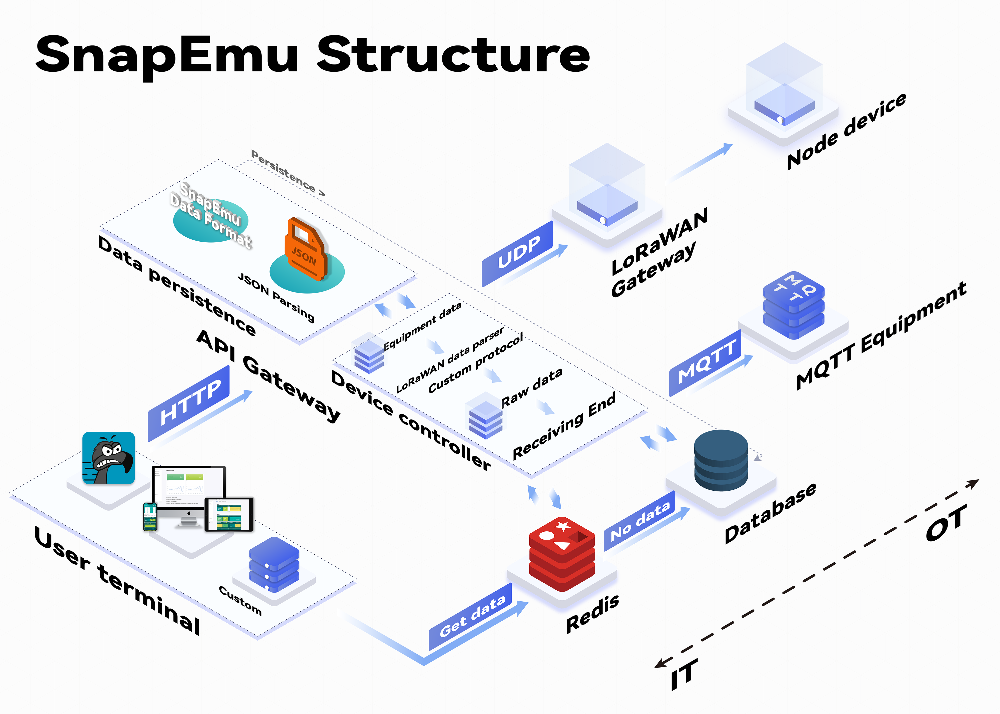
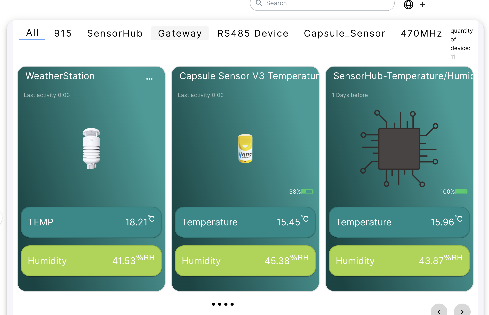
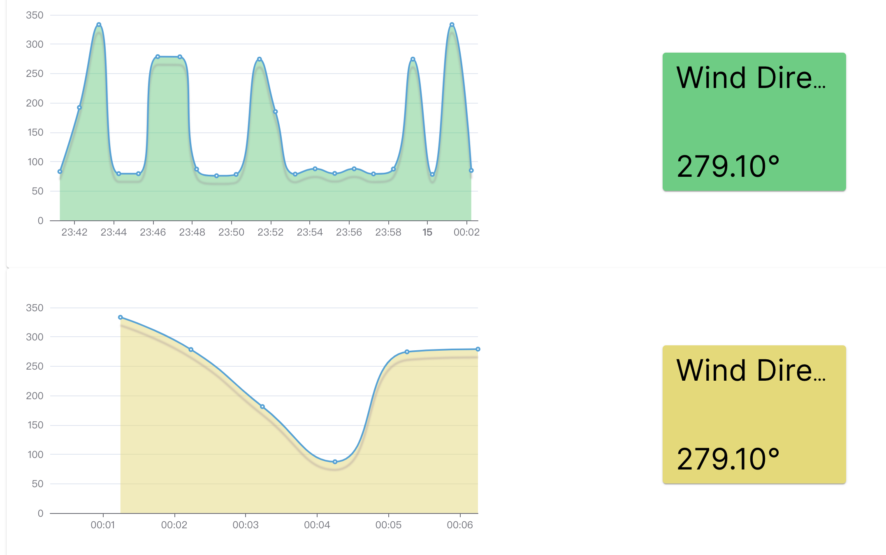
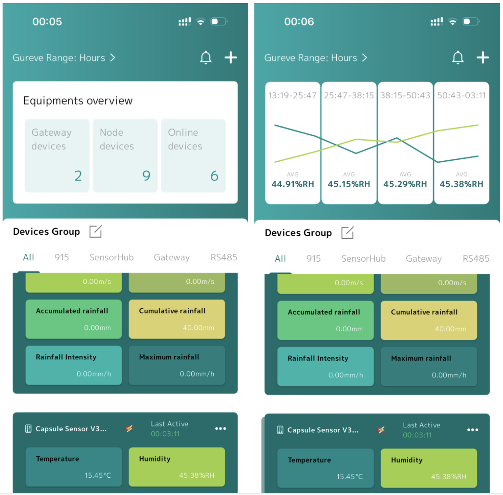

# SnapEmu: Open-source GUI IoT Platform Compatible with LoRaWAN/MQTT

SnapEmu is an open-source GUI IoT platform fully R&D and mantanced by [Heltec Automation](https://heltec.org/)®, to simplify the integration and management of devices using **LoRaWAN** and **MQTT** protocols. It includes a [web platform](https://snapemu.com/) with a GUI interface, and its relevant [IOS](https://apps.apple.com/cn/app/snapemu/id6475621820) and [Android apps](https://play.google.com/store/apps/details?id=com.heltec.snapemu_app), which can analyze, store and display various data in real-time.

You can use the existing [SnapEmu public platform](https://snapemu.com/) to quickly deploy IoT applications, or you can deploy it locally (Your cloud server, edge computing device, Raspberry Pi, etc.), **and the locally deployed SnapEmu can be used as the data source of the APP**.

---

## 🌟 Features

- **LoRaWAN Integration**: Full support for LoRaWAN devices with easy configuration and deployment.
- **MQTT Broker** (use [EMQX](https://github.com/emqx/emqx)): Seamless communication using the lightweight MQTT protocol.
- **Dashboard**: Real-time monitoring and data visualization for connected devices.
- **Device Management**: Add, configure, and manage your devices effortlessly.
- **Open-Source**: Free to use and extend with a developer-friendly architecture.
- **API Support**: RESTful and MQTT APIs for integration with external applications.
- **Security**: Built-in authentication and encryption mechanisms to protect your data.

---

## 🚀 Getting Started

### Prerequisites

- [Docker](https://www.docker.com/) (recommended for quick setup)

By follow the document to getting start:

- [Document](https://snapemudoc.readthedocs.io/en/latest/index.html)

---

## 🛠️ Development

- Source Code: https://github.com/HelTecAutomation/snapemu

- API: https://platform.snapemu.com/api/scalar

---

## 🐛 Issues and Feedback

If you encounter any issues or have feedback, please open an issue on the [GitHub Issues page](https://github.com/yourusername/Snapemu/issues).

---

## 🛡️ License

Snapemu is licensed under the [License](LICENSE).

---

## 🌍 Acknowledgments

Special thanks to all contributors and the open-source community for making this project possible.

